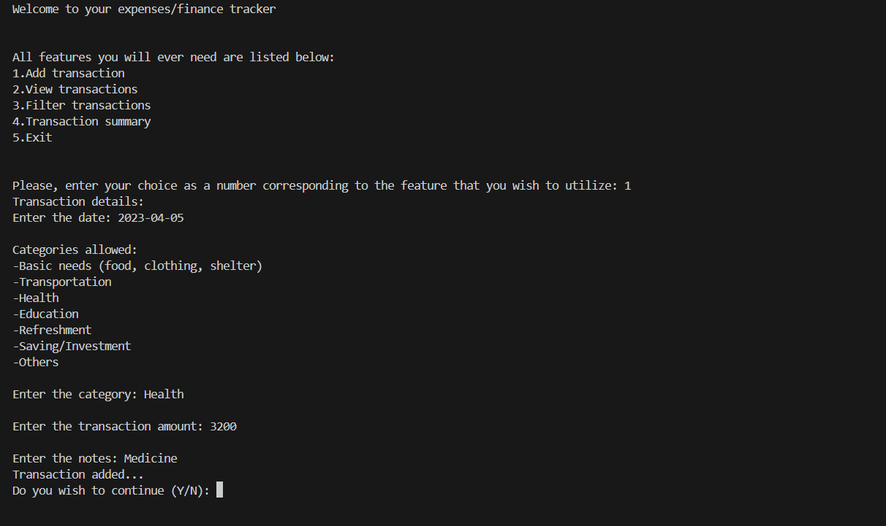
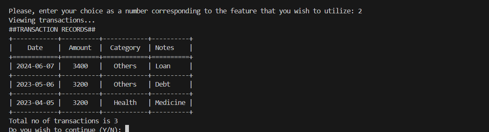
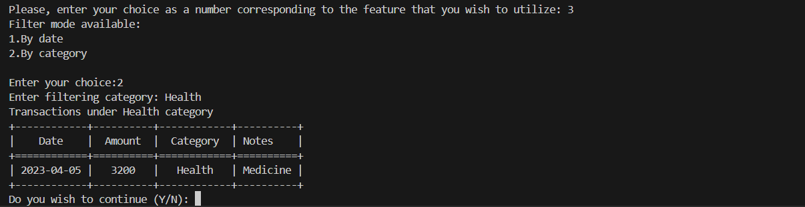
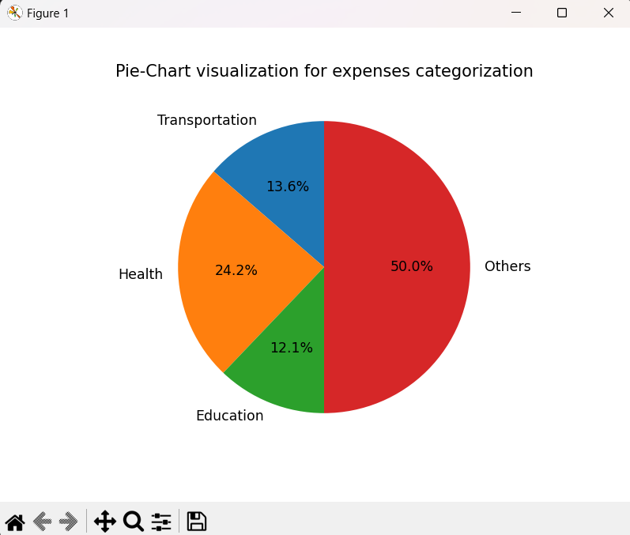

# Python Expense Tracker 🧾💰

&#x20;

A terminal-based expense tracker in Python to record, view, filter, and visualize your daily transactions. Keep your finances organized and see where your money goes with interactive tables and charts.

---

## Demo





*Example Pie Chart of Expenses*



---

## Features ✨

1. **Add Transactions**

   - Record transaction **date, amount, category, and notes**.
   - Categories: Basic Needs, Transportation, Health, Education, Refreshment, Saving/Investment, Others.

2. **View Transactions**

   - Display all transactions in a **neat table** using `tabulate`.
   - Shows **total number of transactions**.

3. **Filter Transactions**

   - **By Date:** Transactions between any two dates.
   - **By Category:** Filter specific spending categories.

4. **Transaction Summary**

   - **Pie chart visualization** of expenses by category.
   - Automatically excludes categories with zero spending.

5. **Exit Option**

   - Exit the tracker safely after your session.

---

## Installation 💻

1. **Clone the repository**

```bash
git clone https://github.com/nirx3/finance-tracker
cd expense-tracker
```

2. **Install dependencies**

```bash
pip install matplotlib tabulate
```

3. **Run the program**

```bash
python tracker.py
```

---

## Usage 🎯

1. Run the program:

```bash
python tracker.py
```

2. Follow prompts to choose an action:

   1. Add a transaction
   2. View transactions
   3. Filter transactions
   4. View summary
   5. Exit

3. When adding a transaction, enter:

   - **Date** (YYYY-MM-DD, default: today)
   - **Category** (default: Others for invalid input)
   - **Amount**
   - **Notes** (optional, default: N/A)

4. Filter by date or category and visualize your spending with pie charts.

---

## File Structure 📂

```
transactions.csv      # Stores all transaction records
tracker.py            # Main Python script with all functionalities
README.md             # Project documentation
images/               # Folder for screenshots and charts
```

---

## Dependencies ⚙️

- Python 3.x
- [matplotlib](https://matplotlib.org/) – plotting pie charts
- [tabulate](https://pypi.org/project/tabulate/) – formatting tables
- Standard libraries: `csv`, `os`, `datetime`

---

## Notes 📝

- If `transactions.csv` does not exist, it is created automatically.
- Input validation:
  - Missing date → defaults to **today**
  - Invalid category → defaults to **Others**
  - Missing notes → defaults to **N/A**

---

## Future Improvements 🚀

- Export functionality (CSV, Excel, PDF)
- Monthly/weekly summaries and trends
- Recurring transactions
- GUI version using Tkinter or PyQt
- Interactive trend charts
- Dynamic category Addition
- Date validation using regex for version-1.0.1
- Additional cool features

---

## License 📜

This project is open-source and free to use.

